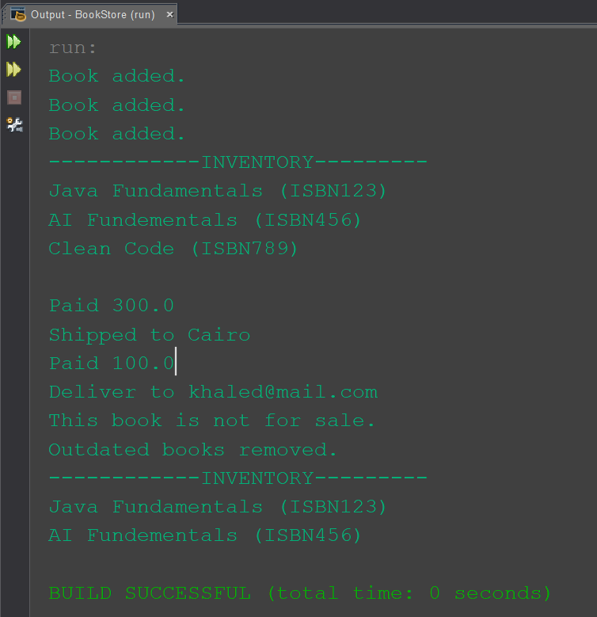

# Bookstore

A simple Java program simulating an online bookstore as part of the **Fawry N² Dev Slope #10 Challenge**.

## Features

- Manage an inventory of different book types:
  - **PaperBook**: Has stock and can be shipped.
  - **EBook**: Delivered via email.
  - **DemoBook**: Showcase only, not for sale.

- Add books to the inventory (ISBN, title, year, price, author).
- Remove outdated books based on publication year.
- Buy books by ISBN:
  - Reduces stock (for PaperBooks).
  - Returns paid amount.
  - Sends to `ShippingService` or `MailService` (print statements).

## Usage

Run to:

1. Add books.
2. Display inventory.
3. Buy books.
4. Remove old books.
5. Display updated inventory.

## Output

  

